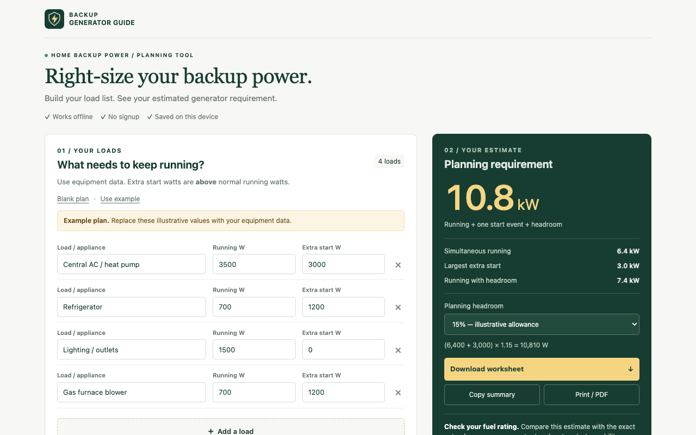

# Generator Size Calculator

An offline Chrome extension from [Backup Generator Guide](https://backupgeneratorguide.com/), adapted from the [Generator Size Calculator](https://backupgeneratorguide.com/tools/generator-size-calculator/).

Build an appliance load plan, compare running and starting power, and keep a draft on your own device. The extension opens from Chrome's toolbar and can expand into a full browser tab.



## Features

- Start with an example plan or a blank plan.
- Add, edit, or remove appliance loads.
- Enter running watts, extra starting watts, and a headroom percentage.
- Review totals and a generator capacity estimate as you edit.
- Automatically save one draft locally, including incomplete inputs.
- Copy the summary, export a CSV, or print the plan.
- Delete the saved plan; undo a plan replacement when offered.

The calculator works without an internet connection. Website links open only when you choose them.

## Install for testing

1. Download and extract the extension ZIP, or clone this repository.
2. In desktop Chrome, open `chrome://extensions` and turn on **Developer mode**.
3. Choose **Load unpacked** and select the folder containing `manifest.json`. In this repository, select `extension/`.
4. Pin **Generator Size Calculator** in Chrome's Extensions menu, then select its toolbar icon.
5. Choose **Open full tab** when you want more space for the load plan.

Chrome Web Store installation will be available after the owner submits the extension and Google approves the listing. A store URL has not been assigned in this source package.

## How to use it

Use appliance labels or manufacturer specifications to replace the example wattages. **Extra starting watts** means the additional demand above the appliance's running power. If equipment documentation gives total starting watts, subtract its running watts before entering the extra starting value. Add the loads you intend to power at the same time, then choose your headroom.

The starting-event estimate is `(sum of running watts + largest extra starting watts) × (1 + headroom)`. A separate continuous estimate is `sum of running watts × (1 + headroom)`. The default headroom is 15%, an illustrative planning assumption. The method assumes all listed loads run together and only one motor starts at a time; simultaneous motor starts can require more capacity. The extension shows planning demand and does not select a generator model.

Example wattages are planning placeholders. The estimate does not validate voltage, phase, transfer equipment, generator motor-starting performance, fuel derating, or installation requirements. Confirm the final choice with appliance and generator documentation and a qualified installer.

## Privacy

The only requested permission is `storage`, used for `chrome.storage.local`. Your load names, wattage inputs, and headroom stay in the current Chrome profile. The extension does not use Chrome sync storage, collect browsing history, read web pages, send analytics, or transmit your plan to Backup Generator Guide.

Copy, export, and print happen only when you choose them. Exported files and copied or printed information are under your control. Deleting the saved plan clears the extension's saved draft; uninstalling the extension also clears its local storage.

Read [PRIVACY.md](PRIVACY.md). A static version ready for website hosting is included at [docs/privacy-policy.html](docs/privacy-policy.html).

## Development

The extension uses Manifest V3 and packaged HTML, CSS, and JavaScript. It has no production dependencies and no remote executable code.

Run from this repository's root:

```sh
npm ci
npm test
npm run check
npm run package
```

The optional browser check is:

```sh
npx playwright install chromium
npm run test:browser
```

The browser check needs the test dependencies and a browser available in the development environment. The installed extension does not need Node.js or these dependencies.

Packaging produces:

- `dist/generator-size-calculator-1.0.0.zip`: upload to the Chrome Web Store or extract for local installation; `manifest.json` is at the archive root.
- `dist/generator-size-calculator-source-1.0.0.zip`: source, tests, documentation, and store assets for sharing on GitHub.

## Publish

[docs/store-listing.md](docs/store-listing.md) contains ready-to-use listing copy and privacy answers. [docs/submission.md](docs/submission.md) covers the store account, required artwork, hosting the policy, submission, and GitHub release steps.

Publishing this source package does not submit an item to the Chrome Web Store. The publisher must finish account requirements and publish an accessible privacy policy before submitting the store form.

## License

[MIT](LICENSE). Copyright 2026 Backup Generator Guide. Branding identifies the original project; a fork should use its own name and publisher identity.
